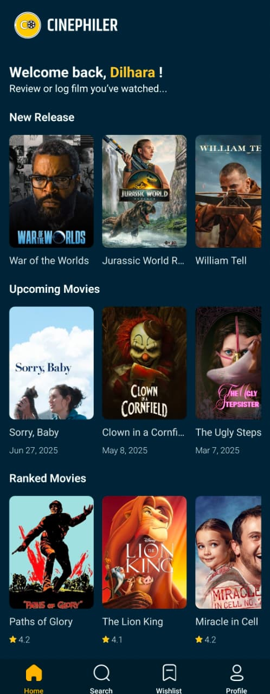
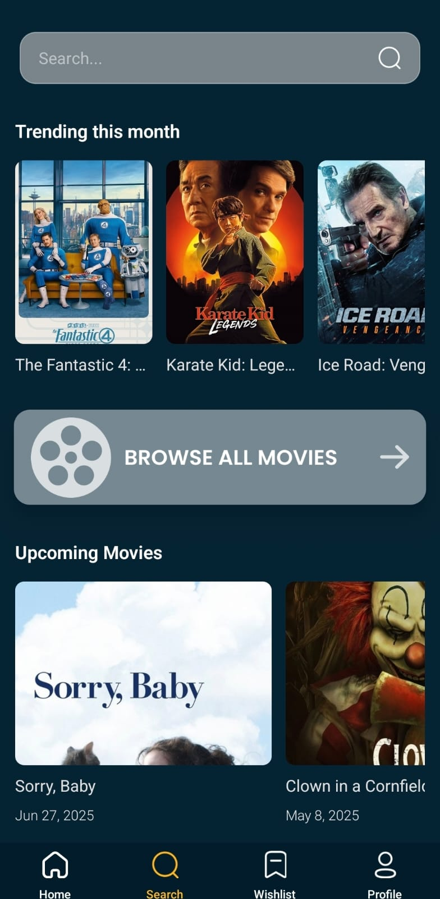
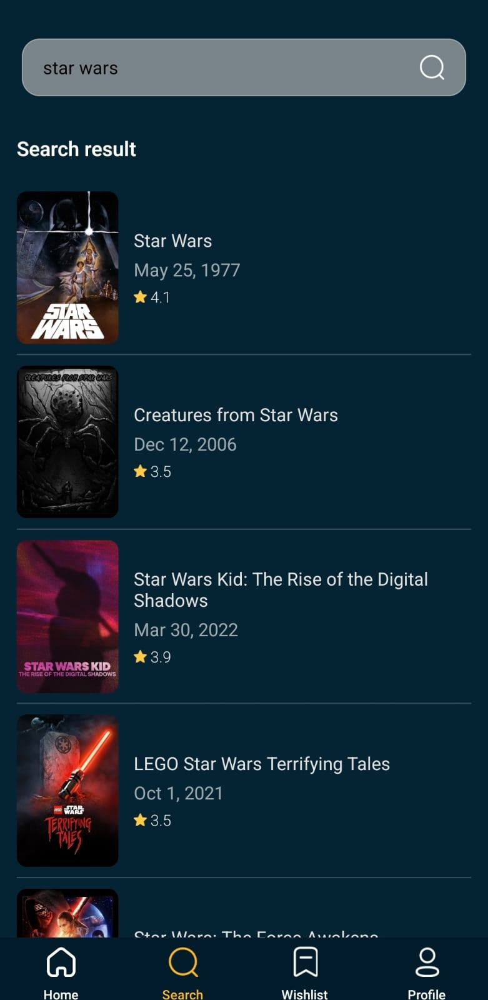
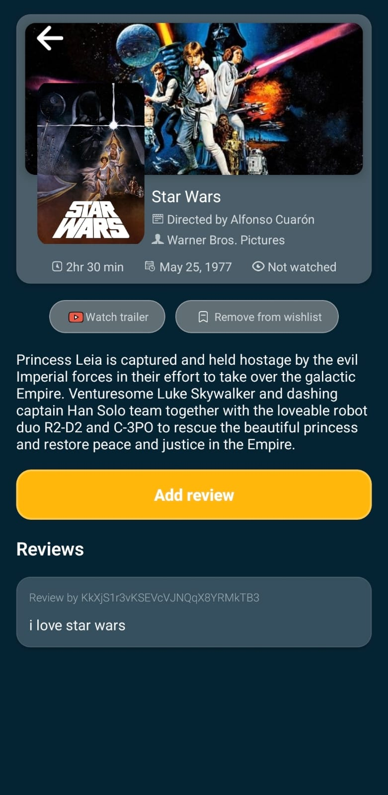
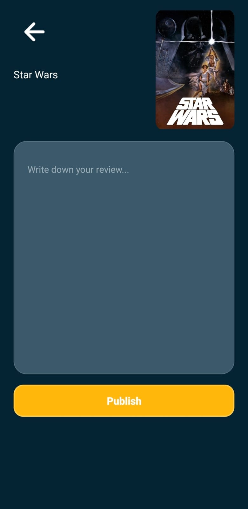
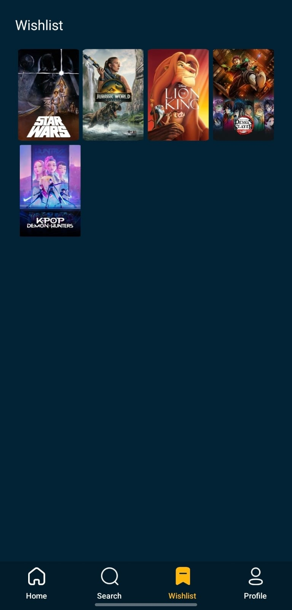

# Project Title

Reviewr - moving reviewing app

## Table of Contents
- [About the Project](#about-the-project)
- [Features](#features)
- [Demo Video](#demo-video)
- [Screenshots](#screenshots)
- [Technology Used](#technology-used)
- [Setup Instructions](#setup-instructions)
- [Future Enhancements](#future-enhancements)


## About the Project

**Reviewr** is a mobile application built with **React Native** that allows users to explore movies, manage a wishlist, and share reviews.  
Users can create an account, log in, search for movies, and view details fetched from the **TMDB API**.


## Features
- **User Authentication** – Sign up, log in, and secure account management with Firebase.
- **Wishlist Management** – Add or remove movies from your personal wishlist.
- **Movie Reviews** – Write and view reviews for movies.
- **Movie Search** – Search for movies by title.
- **Profile Dashboard** – View your wishlist and reviews in one place.
- **TMDB Integration** – Fetch real-time movie details using the TMDB API.
  
## Demo Video
[🎥 Watch the Demo on Google Drive](https://drive.google.com/file/d/1DE9lXHSro0eE2mNAc4-9VPoz3JR2usbQ/preview)

## Screenshots
<p align="center">
  
  
  
</p>

<p align="center">
  
  
   
</p>

<p align="center">
  
  
   
</p>

## Technology used:
- **React Native** – Cross-platform mobile app development
- **Redux** – State management
- **React Navigation** – Screen navigation
- **Axios** – API requests
- **Firebase** – Authentication & Firestore database
- **TMDB API** – Movie data source

## Setup Instructions
1. **Clone the repository**
   ```bash
   git clone https://github.com/sworna13/reviewr.git
   cd reviewr
2. **Install dependencies**
   ```bash
   yarn install
3. **Start the development server**
   ```bash
   yarn start
4. **Run on Adnroid**
   ```bash
   yarn android

## Future Enhancements

-  **Real-Time Reviews** – Display newly added reviews instantly on the movie details page without requiring a refresh.
-  **Movie Ratings** – Implement a star-based rating system for movies.
-  **Review Editing & Deletion** – Allow users to edit or remove their own reviews.


